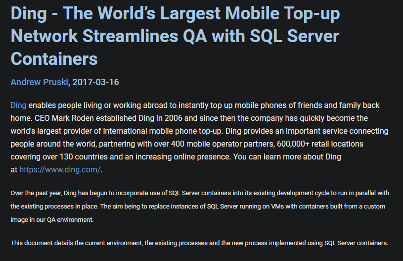
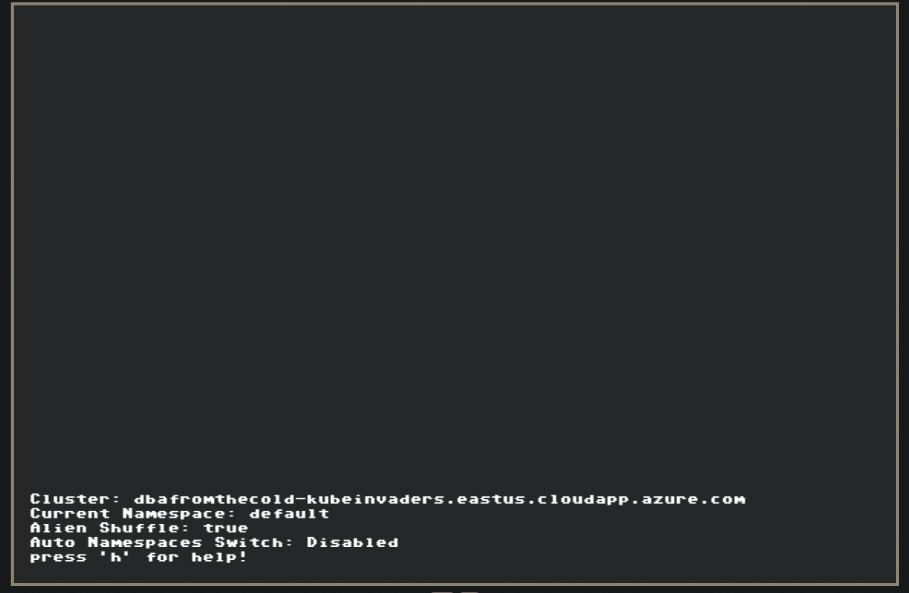

# Pods and Pages
## Databases in Kubernetes

---

## Andrew Pruski

### Principal Field Solutions Architect
#### Microsoft Data Platform MVP 
#### Docker Captain
#### Redgate Ambassador

<!-- .slide: style="text-align: left;"> -->
<i class="fa-brands fa-bluesky"></i><a href="https://bsky.app/profile/dbafromthecold.com">  @dbafromthecold.com</a> 
<i class="fas fa-envelope"></i>  dbafromthecold@gmail.com 
<i class="fab fa-wordpress"></i>  www.dbafromthecold.com 
<i class="fab fa-github"></i><a href="https://github.com/dbafromthecold">  github.com/dbafromthecold</a>

---

### Session Aim
<!-- .slide: style="text-align: left;"> -->

To explore how databases can be deployed and operated in Kubernetes. We'll look at the core DBA responsibilities of availability, recoverability, and performance.

### Agenda
<!-- .slide: style="text-align: left;"> -->

- Why run databases in Kubernetes?
- Getting up and running
- Day 2 operations

---

### Why databases in Kubernetes?
<!-- .slide: style="text-align: left;"> -->

    

---

## A change of mindset
<!-- .slide: style="text-align: left;"> -->
Containers change how we think about databases...
 
 

Do we care about the compute?....really?

 
 

No! We care about the <b><em>DATA</em></b>

---

<a href="https://www.sqlservercentral.com/articles/ding-the-world%E2%80%99s-largest-mobile-top-up-network-streamlines-qa-with-sql-server-containers">
https://www.sqlservercentral.com/articles/ding-the-world%E2%80%99s-largest-mobile-top-up-network-streamlines-qa-with-sql-server-containers
</a>

---

## Streamlining QA
<!-- .slide: style="text-align: left;"> -->
- Current QA process refreshed VMs monthly
- Each refresh required installing SQL Server
- Process took over 45 minutes for each VM
 
 

- New process utilising containers took no more than 2 minutes

---

# Getting up and running
<!-- .slide: style="text-align: left;"> -->

---

## Deploying to Kubernetes
<!-- .slide: style="text-align: left;"> -->

Use StatefulSets rather than Deployments
 
- Built for stateful applications
- Stable pod identity and storage
- Ordered creation and termination
- Persistent storage is uniquely assigned per replica

---

## Kubernetes Storage
<!-- .slide: style="text-align: left;"> -->

<ul>
<li class="fragment">StatefulSets reference PersistentVolumeClaims</li>
<li class="fragment">PersistentVolumeClaims bind to PersistentVolumes</li>
<li class="fragment">StorageClasses describe types of storage</li>
<li class="fragment">Storage persists independently from the pod lifecycle</li>
</ul>

---

### Secrets
<!-- .slide: style="text-align: left;"> -->

<ul>
<li class="fragment">Don't put sensitive information in StatefulSet manifests!</li>
<li class="fragment">Use Secrets to store usernames and passwords</li>
<li class="fragment">Secrets are encoded, not encrypted</li>
</ul>

### Services
<!-- .slide: style="text-align: left;"> -->

<ul>
<li class="fragment">Where are we connecting from?</li>
<li class="fragment">Services provide stable network endpoints</li>
<li class="fragment">Is outside access required?</li>
</ul>

---

## The three main responsibilities
<!-- .slide: style="text-align: left;"> -->
- Availability
- Recoverability
- Performance

---

### Availability
<!-- .slide: style="text-align: left;"> -->

    

---

## One replica?
<!-- .slide: style="text-align: left;"> -->

Deploying a single replica means relying on Kubernetes for recovery rather than database high availability 
Operators can provide database-level high availability capabilities such as:
<ul>
<li class="fragment">Replication</li>
<li class="fragment">Automatic failover</li>
<li class="fragment">Backup and recovery automation</li>
</ul>
 
 

However, operators also introduce additional operational complexity

---

## Probes
<!-- .slide: style="text-align: left;"> -->

<ul>
<li class="fragment">Startup probe</li>
    <ul>
        <li class="fragment">Is SQL Server still starting?</li>
    </ul>
<li class="fragment">Readiness probe</li>
    <ul>
        <li class="fragment">Can we accept connections?</li>
    </ul>
<li class="fragment">Liveness probe</li>
    <ul>
        <li class="fragment">Should Kubernetes restart the container?</li>
        <li class="fragment">A bad liveness probe can become a self-inflicted outage!</li>
    </ul>
</ul>

---

## Tolerations
<!-- .slide: style="text-align: left;"> -->

How long should a database pod remain on an unhealthy node
before Kubernetes evicts it?
 
 
<pre><code data-line-numbers="*|2-5|6-9">tolerations:
- key: "node.kubernetes.io/unreachable"
  operator: "Exists"
  effect: "NoExecute"
  tolerationSeconds: 10
- key: "node.kubernetes.io/not-ready"
  operator: "Exists"
  effect: "NoExecute"
  tolerationSeconds: 10
</pre></code>

---

### Recoverability
<!-- .slide: style="text-align: left;"> -->

    

---

## Backups
<!-- .slide: style="text-align: left;"> -->

Remember...Kubernetes is just another platform

- Still take your backups! 
- Get those backups out of the cluster asap 
- Regular restore testing is critical 

---

## Volume Snapshots
<!-- .slide: style="text-align: left;"> -->

What type of snapshot are we talking about?
  

<ul>
  <li>Crash-consistent snapshots</li>
  <li>Application-consistent snapshots</li>
</ul>

 

  Only application-consistent snapshots should be considered a replacement for native database backups

 

  How portable are those snapshots between storage platforms or clusters?

---

## Volume Reclaim policies
<!-- .slide: style="text-align: left;"> -->

What happens to the volume when the claim is deleted?
 
<ul>
<li class="fragment" data-fragment-index="1">Delete: remove the underlying storage</li>
<li class="fragment" data-fragment-index="2">Retain: keep the underlying storage</li>
</ul>
 
 

That setting can be the difference between recovery and </b><em>a very quiet room</em></b>

---

### Performance
<!-- .slide: style="text-align: left;"> -->

    

---

## Storage
<!-- .slide: style="text-align: left;"> -->

- Go for the fastest storage available to the cluster 
- Follow best practices for database file layout 
- Use snapshots to complement database backups 
- Test storage performance with realistic database workloads

---

## Requests and Limits
<!-- .slide: style="text-align: left;" -->

The noisy neighbour problem!
  

Set CPU and Memory limits
 

Be aware of database quirks!
  

Kubernetes assigns Quality of Service based on requests and limits

<ul>
  <li class="fragment" data-fragment-index="1">Guaranteed</li>
  <li class="fragment" data-fragment-index="2">Burstable</li>
  <li class="fragment" data-fragment-index="3">BestEffort</li>
</ul>

 

  Databases generally should <em>not</em> be BestEffort

---

## Tools for testing performance
<!-- .slide: style="text-align: left;"> -->

- Don't only use synthetic tools for testing 
- Ideally replay production workloads 
- Or use tools that drive known benchmarks 
- Utilise database engine tooling to analyse workloads 

---

### Chaos Engineering
<!-- .slide: style="text-align: left;"> -->

---

### What is Chaos Engineering?
<!-- .slide: style="text-align: left;"> -->
"Chaos Engineering is the discipline of experimenting on a system in order to build confidence in the system's capability to withstand turbulent conditions in production" 
<a href="principlesofchaos.org">principlesofchaos.org</a>

---

## Recent Failure experiments
<!-- .slide: style="text-align: left;"> -->

- Recent testing of an AG operator for SQL Server
<ul>
<li class="fragment">Pod failure</li>
<li class="fragment">Node failure</li>
<li class="fragment">Service interruption</li>
<li class="fragment">Storage Failure</li>
</ul>

---

---

## Resources
<!-- .slide: style="text-align: left;"> -->

<a href="https://github.com/dbafromthecold/pods-and-pages">https://github.com/dbafromthecold/pods-and-pages</a> 

